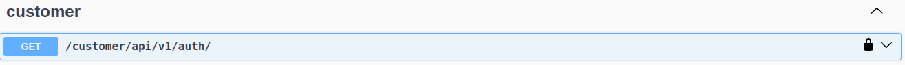
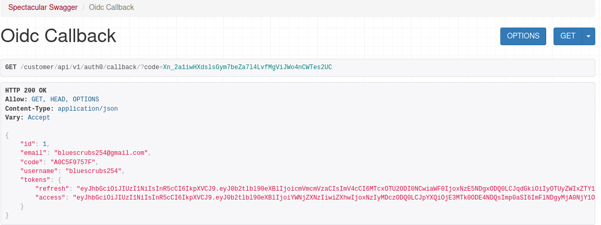
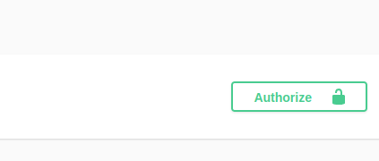
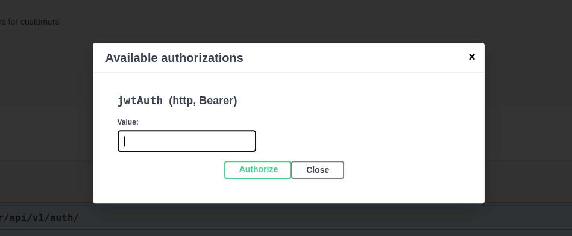
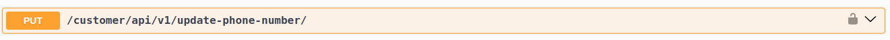
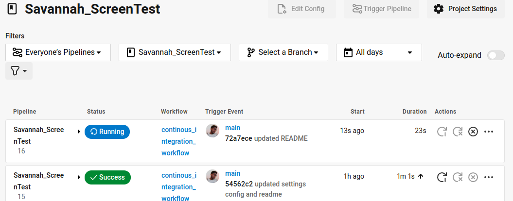

# Savannah Screen Test 1.0

This project is a simple service built using Python and Django DRF that allows you to manage customers and orders through a REST API. It includes authentication and authorization via OpenID Connect and sends SMS notifications to customers when an order is added using Africa's Talking SMS gateway..

## Table of Contents

- [Getting Started](#getting-started)
    - [Live Site](#live-site)
    - [Local Development](#local-development)
  - [Prerequisites](#prerequisites)
  - [Installation](#installation)
- [Project Structure](#project-structure)
- [Features](#features)
- [Testing](#testing)
- [CI/CD](#cicd)
- [License](#license)

## Getting Started
### Live Site
- The live site can be accessed [here](https://web-production-c7112.up.railway.app/)
- Authentication and authorization instaructions are [here](#cusomer-authentication)


### Local Development
Before you begin, make sure you have the following installed on your system:

- Python 3.6 or higher
- pip (Python package manager)
- Virtual environment (optional but recommended) 
- postgres database

### Prerequisites

Knowledge And/Or Curiosity in Python.
A postgres database setup.

### Installation

Provide step-by-step instructions on how to install and set up your project in a linux/mac-os setup.

```bash
# Clone the repository
git clone https://github.com/JamesOmare/Savannah_ScreenTest.git

# Change into the project directory
cd Savannah_ScreenTest

# Create a virtual environment
python -m venv venv

# Activate the virtual environment
source venv/bin/activate

# Install dependencies
pip install -r requirements.txt

# Make and run migrations
python manage.py makemigrations
python manage.py migrate

# Create a superuser (if applicable)
python manage.py createsuperuser

# Run the development server
python manage.py runserver

```

### Create a .env file in your root directory and add the following variables
  
  ```bash
SECRET_KEY="AeHSJpMrJxAk2C0etJuuB53Mck82IVT48AjAbRsCWZg="
DEBUG=True
TEST_CONFIG=False
DB_NAME=<your postgres db name>
DB_USER=<your postgres db user>
DB_PASSWORD=<your postgres db password>
DB_HOST=<your postgres db host>
DB_PORT=<>your postgres db port>
AUTH0_DOMAIN=dev-1i0818cnggbcem0u.us.auth0.com
AUTH0_CLIENT_ID=j3Y8wvdzSdc9bmufNpF5blKGYlKWZIkn
AUTH0_CLIENT_SECRET=6kdYxkKGzDabB0ul4_fMsDLsU1PyyOc3z4rP2Ol9yb-xZPwUfoKOc48xWqsCoHwO
REDIRECT_URI=http://127.0.0.1:8000/customer/api/v1/auth0/callback(also http://localhost:8000/customer/api/v1/auth0/callback can work)
ACCESS_TOKEN_LIFETIME=30
REFRESH_TOKEN_LIFETIME=1
AFRICAS_TALKING_USERNAME=sandbox
AFRICAS_TALKING_SENDER_ID=39711
AFRICAS_TALKING_API_KEY='atsk_0b24511ef76ee87d83cfaebdf77f13cd2ec9c3d7524e82d97071dd129adcc385ee4bed4a'

# XML test runner(was used for Circle CI testing purposes)
TEST_RUNNER = 'xmlrunner.extra.djangotestrunner.XMLTestRunner'
TEST_OUTPUT_DIR = './test_results'
TEST_OUTPUT_FILE_NAME = 'results.xml'
  ```


## Project Structure

This is how the project structure should look like after running the above command.

Suppose you have an app called "authentication" in your project, the structure should look like this

The settings.py file contains our application configuration and tells Django which apps are installed, among other things.


```bash
your_project/
|-- your_app("authentication" in our case)/
|   |-- migrations/
|   |-- static/
|   |-- templates/
|   |-- __init__.py
|   |-- admin.py
|   |-- apps.py
|   |-- models.py
|   |-- tests.py
|   |-- views.py
|-- your_project("core" in our case)/
|   |-- __init__.py
|   |-- settings.py
|   |-- urls.py
|   |-- asgi.py
|   |-- wsgi.py
|-- manage.py
|-- requirements.txt
|-- .env
|-- README.md

```

## Features

These are the features available in the application:

### Cusomer Authentication
- The project uses Auth0 for authentication and authorization via OpenID Connect. Ensure you have your Auth0 credentials set up in the .env file provided above(you only need to have your local postgres setup credentials)
- First go to this api:


- It will return a url upon which when entered into the browser will redirected to the Auth0 login page.
- Here you can log in with google or use application test credentials below:(note that you'll only use the password email authentication once, subsequent logins won't require the email and password combination)
- Email: bluecrubs254@gmail.com
- Password: Password_123#
- You'll be redirected to this page where you'll be presented with the registered user's data and tokens:

- Copy the access token, go to this authorize button:

- And paste the access token here and click authorize to authorize the user:

- You can now use the orders api's to perform create,read, update and delete operations.
- N/B - Its advised to use shorter lifespans of access tokens but I made it longer to avoid continous authentication when they expire. You can change the lifespan in the settings.

### Order Management
- Before creating orders, ensure you update your number in this api so that sms can be sent with each order created:



### SMS Notifications:
- The project uses Africa's Talking SMS gateway to send notifications. Ensure you have your Africa's Talking API credentials set up in the .env file.

# Testing
### Tests
- The application has two apps, customer and order. I have set up unit and integration tests on both applications and can be found in app_name/tests folder.
- To run test run the following command:
```
python manage.py test
```

### Coverage
- Here is thecomand to run coverage
```
coverage run manage.py test
```
- To generate coverage report
```
coverage report -m
```

# CI/CD
- For Continous Integration, I used Circle CI to set up my pipeline as decribed in this yaml file.  This setup ensures that each code commit undergoes a series of automated tests and builds, maintaining code quality and reliability before any updates are merged into the main branch.
```
version: 2.1

orbs:
  python: circleci/python@2.1.1

jobs:
  build-and-test:
    docker:
      - image: cimg/python:3.10.12
      - image: cimg/postgres:14.1
        environment:
          POSTGRES_USER: example

    steps:
      - checkout
      - python/install-packages:
          pkg-manager: pip

      - run:
          name: Install Python dependencies
          command: pip install -r requirements.txt

      - run:
          name: run tests
          command: python manage.py test

workflows:
  continous_integration_workflow:
    jobs:
      - build-and-test
```
- The project is configured with GitHub for seamless integration. Whenever I push commits to a branch, the project automatically builds and runs tests. If the tests pass and the build is successful, the branch is updated accordingly. For deployment, I use Railway, a powerful deployment SaaS. Railway is set up with Continuous Delivery (CD) and is connected to my GitHub branch. Upon a successful deployment triggered by CircleCI, which handles the initial build and test processes, Railway takes over. It builds the application and, if the build is successful, deploys it to the production environment.


# License

Free License.
